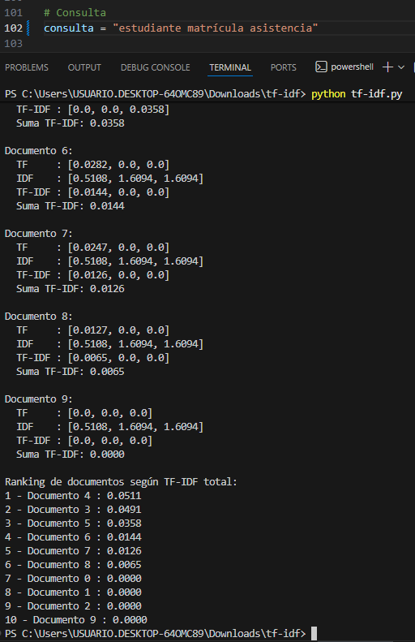

- `tf-idf.py` : Script principal que realiza los cálculos y genera el ranking.
- `documents.txt` (opcional) : Puedes reemplazar o agregar documentos en este archivo si deseas ampliar el corpus.

---

## Cómo usar

1. **Editar los documentos**  
   Dentro de `tf-idf.py`, la lista `documents` contiene los textos. Puedes agregar, eliminar o modificar documentos directamente en esa lista.

2. **Cambiar la consulta**  
   Modifica la variable `consulta` con la palabra o palabras que quieres buscar:

```python
consulta = "estudiante matrícula asistencia"
Ejecutar el script
python tf-idf.py
Ver los resultados
El script mostrará:
TF de cada término por documento
IDF de cada término
TF-IDF individual y suma por documento
Ranking final de documentos según relevancia

Ejemplo de ranking generado:

Posición	Documento	Suma TF-IDF
1	Documento 4	0.0511
2	Documento 3	0.0491
3	Documento 5	0.0358
…	…	…

[Ejecución 2 del codigo TF-IDF](imagenes/prueba2.png)
[Ejecución 3 del codigoTF-IDF](imagenes/prueba3.png)